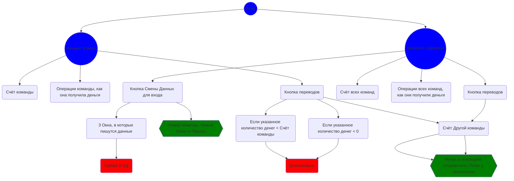

##  Сайт для МИЦ

## Версия 1.0.3

В money.php - наброски кода для отправки Денег между командами
Проверка кода была через MySQL

## Версия 1.0.4
Добавлена 1 строчка В таблицу `Teams`, связанную с ней строчку в `Operation`

## Логика работы сайта:

## Описание
При входе через Админа выводятся ВСЕ Операции ВСЕХ пользователей, Счёт всех команд (сумма очков по операциям), Кнопка смена данных для входа, которая перекидывает в окно, где указывается команда(которой нужно сменить данные), новый логин и пароль, Кнопка переводов, которая перекидывает в отдельное окно, где указывается команда-отправитель(привязана к логину), сумма перевода(с условием блока операции, если написано отрицательное значение/Значение, которое больше счёта этой команды), команда-получатель. После перевода всё выводится в операции. 
При входе через Обычного Пользователя выводится счёт конкретно этой команды, операции команды, Кнопка переводов, которая перекидывает в отдельное окно, где указывается команда-отправитель(привязана к логину), сумма перевода(с условием блока операции, если написано отрицательное значение/Значение, которое больше счёта этой команды), команда-получатель.

## Code:
- [ ] Закодить кнопку переводов
    - [ ] Переброс на отдельную страницу
    - [ ] 2 Окна для Ввода данных
        - [ ] Цифра команды, Сумма перевода,
        - [ ] Учёт двух условий 
    - [ ] Отдельная кнопка `отправить`, Запускающая скрипт 
- [ ] Добавить админу кнопку смены Данных
    - [ ] Смена логина, Пароля
    - [ ] Кнопка, которая делает UPDATE В DB
## CSS:
- [ ] Добавить и стилизовать кнопку переводов
- [ ] Стилизовать Вход
- [ ] Стилизовать Профиль
- [ ] Добавить задники на сайт

## DOCKER
-- подлючиться к базе
mysql -u user -ppassword

-- поднять
docker-compose up

-- потушить
docker-compose down -v

## MYSQL

-- консоль
mysql -u user -ppassword;

-- дамп из базы
mysqldump -u user -ppassword --no-tablespaces Testing > dump.sql;

-- дамп в базу
mysql -u user -ppassword < dump.sql;
